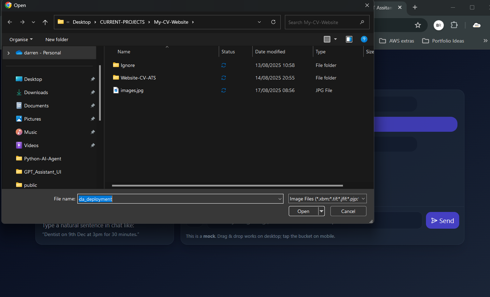
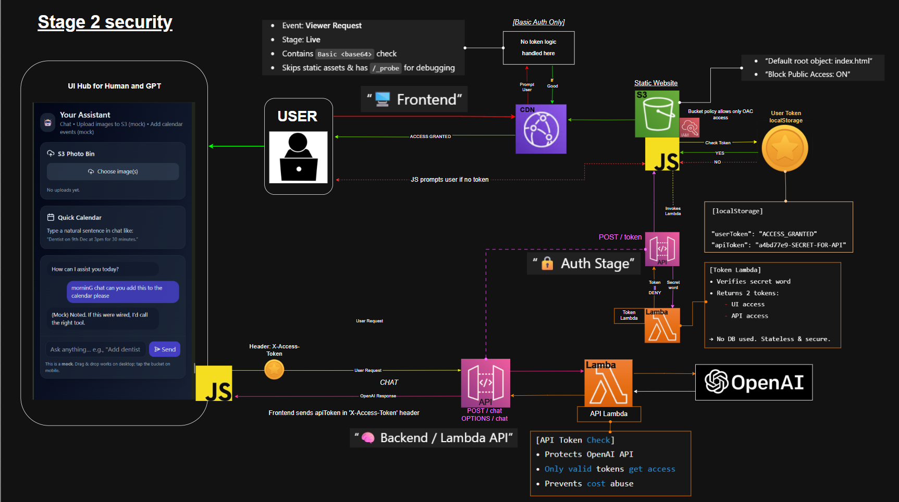

# 🧠 GPT Assistant

**GPT Assistant** is a personal AI-powered assistant that combines OpenAI’s GPT with AWS services to create a smart, serverless productivity tool.

---

## ✨ Features

- 🧠 Natural language chat  
- 📆 Calendar event creation from plain text (e.g., `Dentist on 9th Dec at 3pm`)  
- 🖼️ Image uploads to an S3 bucket for further processing  
- ⚙️ Serverless backend powered by AWS Lambda, OpenAI, and Python agents  

---

## 🗺️ Interface & Architecture

### 💻 Main UI  

### 🧺 Image Drop Box  

---

### 🧱 Architecture Evolution

#### 🧪 First local mockup  

#### 🔗 Added AWS interactions  

---

### 🔐 Security Architecture

#### 🛠️ Stage 1 – Connect to OpenAI API  
- Static site hosted on S3  
- Basic Auth handled via CloudFront  
- Lambda holds the OpenAI secret key (not exposed to the frontend)  
- Chat messages are passed from JS to Lambda  
- No token validation yet  

---

#### 🧪 Stage 2 – Token Validation + API Security  
- Introduces a second Lambda to verify a **secret word** and return 2 tokens:  
  - `userToken` (UI access)  
  - `apiToken` (API access)  
- Tokens stored in `localStorage`, used in headers  
- JS checks `userToken` before allowing UI usage  
- API Gateway/Lambda checks `apiToken` before forwarding to OpenAI  
- No DB used — stateless design  

---

## ⚙️ System Overview

The assistant runs across **3 main layers**:

### 1. 🎨 Frontend (User Interface)

- Built with **React + Vite + Tailwind CSS**
- Hosted as a static site on **Amazon S3**
- Two key components:
  - 📤 **Image Uploader** — drag and drop images → uploaded to S3
  - 💬 **Quick Calendar Chat** — accepts natural language like:  
    `"Add dentist appointment 9 Dec at 3pm"`

---

### 2. 🧠 Backend (Lambda + GPT + Python Agent)

- **Chat messages** → API Gateway → Lambda → OpenAI
- **Uploaded images** → S3 → Event triggers Lambda → GPT/Python agent

#### 🔧 Python Agent
- Parses GPT responses
- Detects structured data (like events, reminders)
- Calls **Google Calendar API** when needed (optional future step)

---

### 3. ☁️ Infrastructure (AWS Stack)

- **Amazon S3** — static frontend + image inbox
- **CloudFront** — access control via Basic Auth
- **API Gateway** — connects frontend to Lambda
- **AWS Lambda** — serverless logic
- **IAM roles + OAC (Origin Access Control)** — secure S3 access
- **localStorage tokens** — used for lightweight UI/API auth

---

## 🚀 Deployment Guide (Work in Progress)

The project is currently in **active development**, and deployment will come later.

Right now the focus is on:

- ✅ Building a secure token system (done)
- ✅ Connecting the UI to Lambda and OpenAI (done)
- 🔧 Adding calendar functionality via the GPT assistant (in progress)
- 🔧 Sending calendar events to Google Calendar (next step)

Once those pieces are in place, we’ll add a full deployment walkthrough with:

- S3 static site setup
- Lambda packaging
- Environment variables
- API Gateway + permissions
- Optional domain + HTTPS setup

Stay tuned — deployment instructions will land when the assistant can **actually write to your calendar**.

For now: **local dev + AWS testing is the path.**

