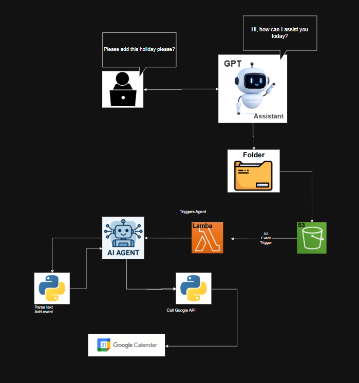
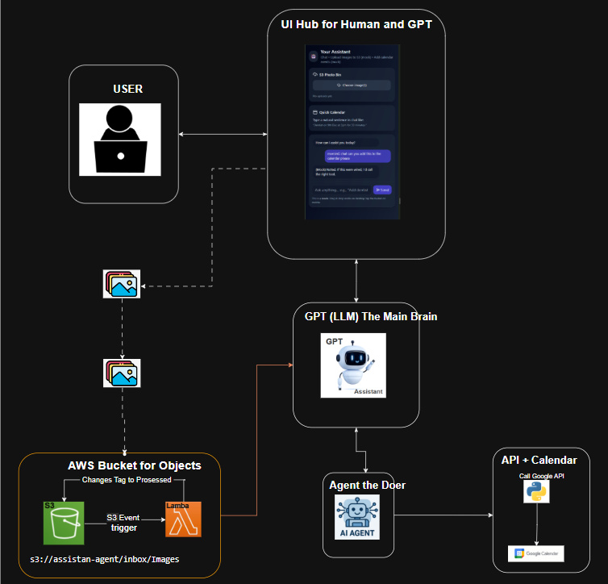
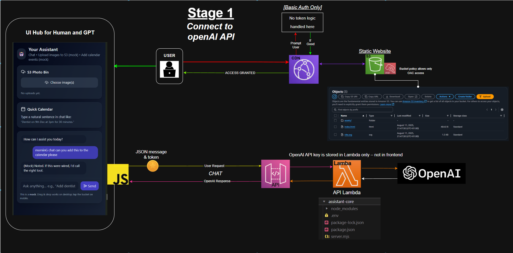
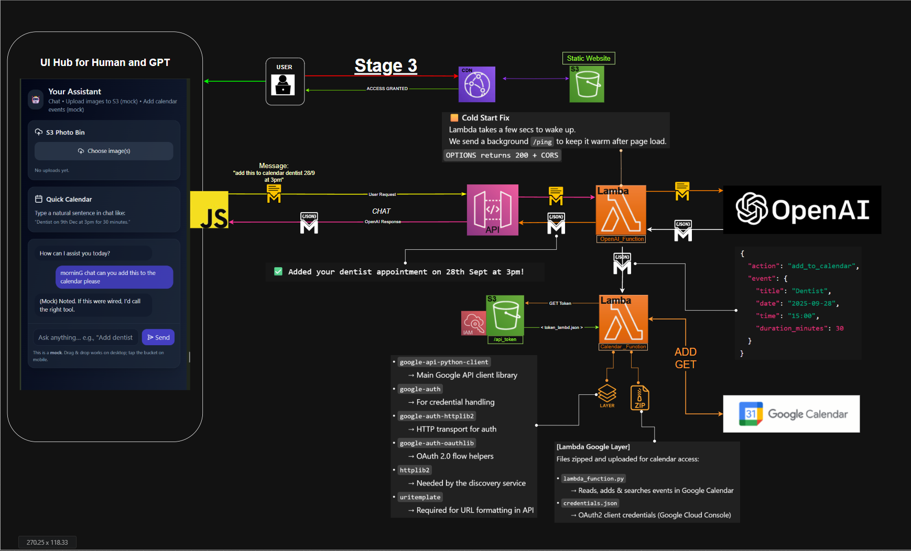

# 🧠 GPT Assistant

**GPT Assistant** is a personal AI-powered assistant that combines OpenAI’s GPT with AWS services to create a smart, serverless productivity tool.

---

## 🧰 Tech Stack

---

## ✨ Features

* 🧠 Natural language chat
* 📆 Calendar event creation from plain text (e.g., `Dentist on 9th Dec at 3pm`)
* 🖼️ Image uploads to an S3 bucket for further processing
* ⚙️ Serverless backend powered by AWS Lambda, OpenAI, and Python agents

---

## 🗺️ Interface & Architecture

### 💻 Main UI

### 🧺 Image Drop Box

---

### 🧱 Architecture Evolution

#### 🧪 First local mockup

#### 🔗 Added AWS interactions

#### 🔐 Stage 1 – Connect to OpenAI API

#### 🔐 Stage 2 – Token Validation + API Security

#### 🚀 Stage 3 – Full Calendar Logic + Lambda Warm Ping

> *Want to see the earlier versions?*
> All previous architecture stages are available in `./readme-images/archive/` if you'd like to follow the project evolution.

---

## ⚙️ System Overview

The assistant runs across **3 main layers**:

### 1. 🎨 Frontend (User Interface)

* Built with **React + Vite + Tailwind CSS**
* Hosted as a static site on **Amazon S3**
* Two key components:

  * 📤 **Image Uploader** — drag and drop images → uploaded to S3
  * 💬 **Quick Calendar Chat** — accepts natural language like:
    `"Add dentist appointment 9 Dec at 3pm"`

---

### 2. 🧠 Backend (Lambda + GPT + Python Agent)

> ⚠️ **Note:** AWS Lambda functions experience a short delay on first use after inactivity (known as a *cold start*).
> To soften this, we added a fun three-dot animation while the assistant "wakes up." ☕

* **Chat messages** → API Gateway → Lambda → OpenAI
* **Uploaded images** → S3 → Event triggers Lambda → GPT/Python agent

#### 🔧 Python Agent

* Parses GPT responses
* Detects structured data (like events, reminders)
* Calls **Google Calendar API** when needed

### 🎭 Small UX Touches

To improve the feel during slow **Lambda cold starts**, a playful **three-dot animation** appears when the assistant is "thinking."

> *"Please wait... the assistant is making a brew."* ☕😄

---

### 3. ☁️ Infrastructure (AWS Stack)

* **Amazon S3** — static frontend + image inbox
* **CloudFront** — access control via Basic Auth
* **API Gateway** — connects frontend to Lambda
* **AWS Lambda** — serverless logic
* **IAM roles + OAC (Origin Access Control)** — secure S3 access
* **localStorage tokens** — used for lightweight UI/API auth

---

## 🗓️ Calendar Integration

We’ve now added **Google Calendar support** to the GPT Assistant!

### ✅ Current Features:

* Add events directly to Google Calendar
* Read existing events
* Search upcoming events by keyword (e.g., “brainstorm”)
* Automatic color-coding:
  Events containing **"annual leave"** will show up in **green** (via `colorId`)

### 🔐 Dual Token Setup (Coming Soon):

To safely support both **local testing** and **AWS Lambda deployment**, we’ll use:

| Environment | Token File          | Description                      |
| ----------- | ------------------- | -------------------------------- |
| 🧪 Local    | `dev-token.json`    | Stored locally, used for dev     |
| ☁️ AWS      | `lambda-token.json` | Stored in S3, fetched at runtime |

We’ll also introduce logic to auto-detect whether the function is running **locally** or in **Lambda**, and load the correct token accordingly.

---

## 🔧 Next Steps

### 🧱 Stage 3 Wrap-up: Final Calendar Wiring

* [ ] Finalize token routing logic (dev vs lambda)
* [ ] Confirm Lambda access to `lambda-token.json` in S3
* [ ] End-to-end event add from chat UI to Google Calendar

### 🖼️ Stage 4 – Image Uploads (Next Up!)

* [ ] Drag & drop image → JS grabs file
* [ ] JS sends image + metadata to Lambda via POST
* [ ] Lambda saves image in S3 (unique folder per user)
* [ ] Return success ✅ message to UI
* [ ] (Optional): store metadata in DynamoDB (e.g., “Holiday Image: France 2024”)

---

## 🧠 Assistant's Growing Brain

This project evolves step by step, building toward a vision where your AI assistant:

* Understands natural language (via GPT)
* Handles tasks (via Python agents)
* Automates your schedule (via Calendar API)
* Manages your uploads (via S3)
* Learns preferences and improves (via memory/rewards system)
* Lives fully serverless (via AWS)

Stay tuned — this assistant's just warming up ☕🤖

---

## 🚀 Deployment Guide (Work in Progress)

The project is currently in **active development**, and deployment will come later.

Right now the focus is on:

* ✅ Building a secure token system (done)
* ✅ Connecting the UI to Lambda and OpenAI (done)
* 🔧 Adding calendar functionality via the GPT assistant (in progress)
* 🔧 Sending calendar events to Google Calendar (next step)

Once those pieces are in place, we’ll add a full deployment walkthrough with:

* S3 static site setup
* Lambda packaging
* Environment variables
* API Gateway + permissions
* Optional domain + HTTPS setup

For now: **local dev + AWS testing is the path.**
